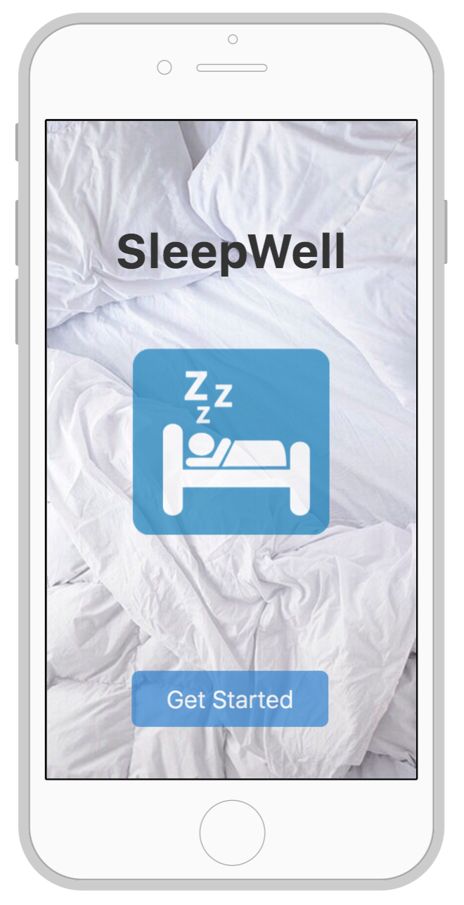
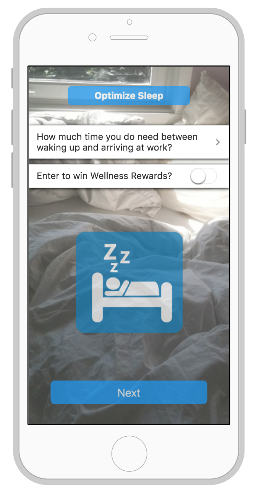

# sleep-text-reminder
Sends scheduled SMS message sleep reminder to phone. Built at the Stanford Health++ Hackathon.

Part of the [SleepWell](https://devpost.com/software/sleepwell) production process. 

Back-end reminder integration for iOS application under development. 

Proposed front-end:

 
